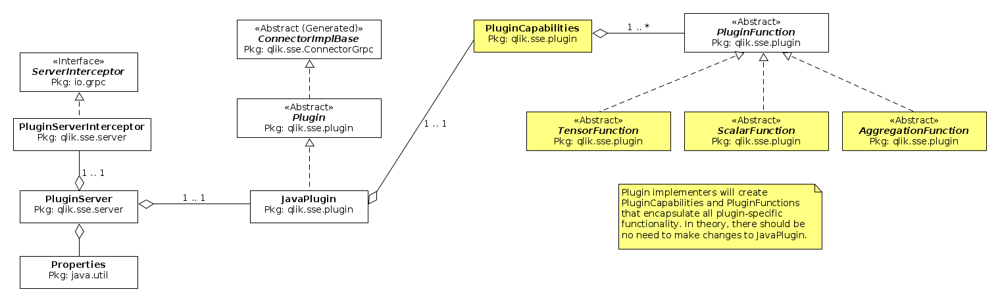

# JavaSSE: Java Server-Side Extension Plugin Server

This project is derived from the java-based "basic example"
[qlik-oss/servier-side-extension/examples/java/basic_example](https://github.com/qlik-oss/server-side-extension/tree/master/examples/java/basic_example) 
which is part of a larger collection of examples for various languages 
[qlik-oss/server-side-extension](https://github.com/qlik-oss/server-side-extension).

Note that while this project is derived from the above mentioned "basic example", you will find
very little similarity. The code has been extensively refactored to allow for a more object-oriented 
approach to implementation of a plugin, allow for more reuse, and to isolate to the greatest
degree possible the gRPC-based server logic from the implementation of SSE functions. Essentially, SSE "function" logic that runs as a plugin has been isolated from the server logic itself.

## JavaSSE Architecture

This image represents a high-level view of the object model for the javaSSE application.

 

As mentioned in the introduction, the goal of JavaSSE is to abstract away the complexities of the
server logic that interfaces with gRPC (protocol buffers, callbacks, etc.) so that implementers can
focus their time and attention on the functions that they want to implement. In theory, users 
should only need to implement an instance of *PluginCapabilities* along with an instance
of *PluginFunction* for each function that needs to be defined. 

There are several example implementations that you can review to get a better understanding:

* [Java SSE Sample Plugin](https://github.com/Qlik-PE/javaSSE/tree/master/src/main/java/qlik/sse/plugin/sample)
* [SecSSE Server-Side Extension](https://github.com/Qlik-PE/javaSSE/tree/master/src/main/java/qlik/sse/plugin/secsse)
* [AES Encryption/Decryption SSE](https://github.com/Qlik-PE/javaSSE/tree/master/src/main/java/qlik/sse/plugin/aesencryption)

## Javadoc

You can find the Javadoc for JavaSSE [here](https://qlik-pe.github.io/javaSSE/apidocs/index.html).

## Building JavaSSE

Building JavaSSE is straight forward using Maven:

    # clone the repository
    git clone https://github.com/Qlik-PE/javaSSE
    
    # build using Maven
    mvn package

This will create a "shaded" jar file that contains all of the dependencies required for execution,
making it easier to test the application on different servers.

Assumptions: gmake, Maven, and OpenJDK 8 (or Oracle Java SE 8) are all installed 
and configured. Note that this project is built and tested with OpenJDK 8.

## Command Line Execution

Once you have built the application using **mvn package**, execution is straight-forward 
as all dependencies are included in the generated jar file:

    java -cp qlik-java-sse-1.2.jar qlik.sse.server.PluginServer <arguments>

For example, execute

    java -cp qlik-java-sse-1.2.jar qlik.sse.server.PluginServer --help

to review the various command line options. As of this writing, the *--help* option
will generate the following message (new options may be added in the future).

```
[jneal@centos-1 target]$ java -cp qlik-java-sse-1.2.jar qlik.sse.server.PluginServer --help
usage: SSEPlugin [-h] [--port PORT] [--pemdir PEM_DIR]
                 [--capabilities FUNCTION_LIST] [--plugin PLUGIN]
                 [--properties-file PROPERTIES_FILE]

A java-based server for Qlik Sense Server Side Extensions.

named arguments:
  -h, --help             show this help message and exit
  --port PORT            The port that the server will listen on
  --pemdir PEM_DIR       The directory where pem-related  files are stored.
                         Required to establish secure connections.
  --capabilities FUNCTION_LIST
                         A  class  that   lists/defines   the  capabilities
                         (functions) of this SSE server
  --plugin PLUGIN        The main plugin class to load
  --properties-file PROPERTIES_FILE
                         The path to a properties  file where these options
                         may also be set
[jneal@centos-1 target]$ 
```

## Properties File

Not all of the configuration options available in JavaSSE are accessible via the
command line. All configuration options may be configured in a properties file. 
To configure JavaSSE to access a properties file, use the`--properties-file <file_name>`
command line option. 

Note also that this is an easy way to pass your own options that might be required by your
SSE function into the application. You can enter any properties names and values you wish 
in the properties file. They will be parsed and made available to you.

For example, you could add a property

    my.favorite.color = green

and then access that property in your code.

```
// the parsed properties are available via a static
// function in PluginSserver.
Properties properties = PluginServer.getProperties();
String favoriteColor = properties.getProperty("my.favorite.color");
// or in abbreviated form
String favoriteColor = PluginServer.getProperties()..getProperty("my.favorite.color");
```

## Logfile Management

JavaSSE uses slf4j coupled with log4j for logging. If you are unfamiliar, you can read
up on them here:

* [slf4j](http://www.slf4j.org/)
* [log4j](https://logging.apache.org/log4j/2.x/)

The default log4j properties configured for JavaSSE can be found in 
[this file](https://github.com/Qlik-PE/javaSSE/blob/master/src/main/resources/log4j.properties).

If you want to override these in order to set different logging levels, a different log file,
etc. you can do so by creating your own file `log4j.properties` and add it as the **first** entry 
your java class path. Your file must be found in the class path somewhere before the default
properties file in order to take effect.

    java -cp "./log4j.properties;qlik-java-sse-1.2.jar" qlik.sse.server.PluginServer 
                    --properties-file my.properties


## SSE Documentation
For more information on Server-Side Extensions in general, see the following links.
* [Overview](https://github.com/qlik-oss/server-side-extension/blob/master/docs/README.md)
* [Communications Flow](https://github.com/qlik-oss/server-side-extension/blob/master/docs/communication_flow.md)
* [Generating certificates for secure connection](https://github.com/qlik-oss/server-side-extension/blob/master/generate_certs_guide/README.md)
* [Configuring SSE plugins in Qlik Sense and QlikView](https://github.com/qlik-oss/server-side-extension/blob/master/docs/configuration.md)
* [Writing an SSE Plugin](https://github.com/qlik-oss/server-side-extension/blob/master/docs/writing_a_plugin.md)
* [Protocol Documentation](https://github.com/qlik-oss/server-side-extension/blob/master/docs/SSE_Protocol.md) (API Reference)

